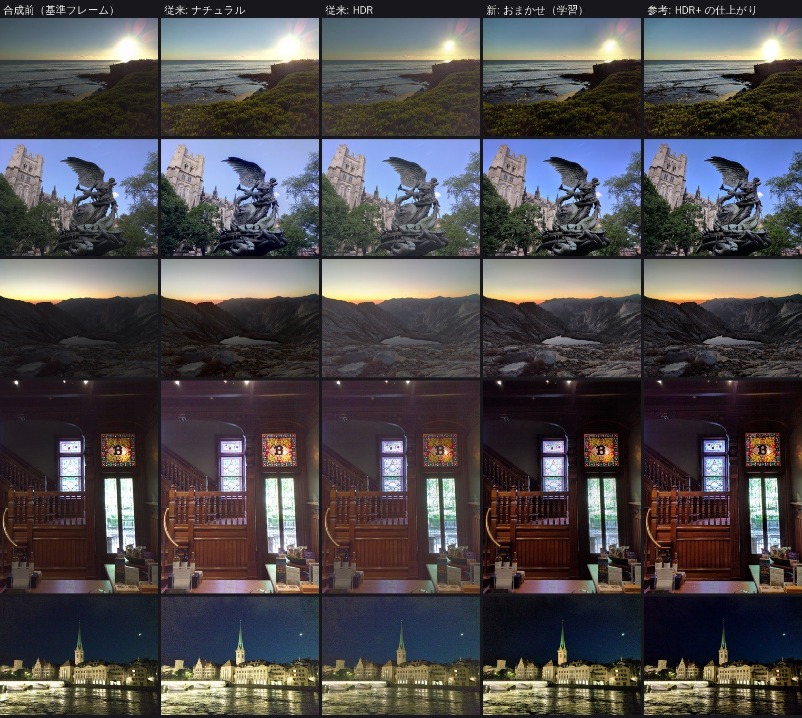

# お手軽AEB合成

オートブラケット（AEB）で撮った露出違いの写真を、**ブラウザだけで** HDR 合成する Web アプリです。
写真 1 枚からでも、何枚まとめてでも使える **Leica M10 の色の再現**もあります（画面上部のタブで「AEB 合成」と「Leica M10 の色」を切り替えます）。
**Canon EOS R6 Mark II の CR3 RAW**（通常 RAW / C-RAW）をそのまま読み込めます。
画像はすべて端末内（WebAssembly / Web Worker）で処理され、サーバーには送信されません。

**▶ 公開ページ: https://freudelaufet358358-a11y.github.io/Otegaru-AEB/**

## できること

### 「AEB 合成」タブ

- 写真をまとめてドロップするだけで、並べ替え → 位置合わせ → 合成まで自動
- 3 つの合成方式
  - **おまかせ**（学習済みモデル・既定）: 約 3,500 シーンの「RAW を合成した HDR データ」と「仕上がった写真」の組から、明るさ・メリハリ・彩度のバランスを学習したモデルで、写真らしく仕上げる（→ [「おまかせ」モードについて](#おまかせモードについて)）
  - **ナチュラル**（露出フュージョン / Mertens 法を自然な仕上がり向けに調整）: 明るい部分は明るく・暗い部分は暗いまま残し、白飛び・黒つぶれだけを他の写真で補う
  - **HDR**（トーンマッピング）: RAW のリニアデータから放射輝度を合成し、局所トーンマッピングで暗部・明部を起こす
- 手持ち撮影向けの自動位置合わせ: **回転と 1 画素未満のずれまで補正**し、共通領域へ自動トリミング
- 位置の手動微調整: 写真ごとに上下左右（0.25px 単位から）と傾きを調整。**等倍ルーペ**（重ね表示 / 差分表示）で二重になっていないか確認しながら直せる
- 効果の調整: **効果の強さ**（元の写真とのブレンド）。おまかせでは**明るさ補正**（EV）、ナチュラル・HDR では**ディテール（立体感）**、HDR では明暗差の圧縮も調整可
- 露出差は EXIF だけでなく画像そのものから推定（シャッター速度表記の丸め誤差に影響されない）
- 合成前（基準フレーム）との比較スライダー
- 仕上げ調整（明るさ・コントラスト・彩度）
- 合成した写真を「Leica M10 の色にする」で「Leica M10 の色」タブに送り、色を仕上げられる（仕上げ調整の値も引き継ぐ）
- JPEG（EXIF の機種・撮影日時付き）/ PNG / 16bit TIFF で保存。サイズ指定も可能

### 「Leica M10 の色」タブ

- **1 枚でも、何枚まとめてでも使える**（AEB で撮っていない写真でも可）。RAW（CR3 など）も JPEG も読み込め、一覧で選んだ写真をプレビューする
- **まとめて保存**: 読み込んだ写真をすべて同じ設定で変換し、1 つの ZIP ファイルにまとめて保存する（進み具合の表示・中止つき）。AEB の合成結果も一緒に入れられる（合成結果の設定はそれぞれ別）
- Leica M10 で撮ったような色にする。Leica M10 と Canon の色の違い（センサーの分光感度・Leica 独自の色行列・カメラ内 JPEG の色づくり）を実データから測って再現する（→ [「Leica M10」の色について](#leica-m10の色について)）
- 「Leica の効き」と「階調も Leica のカメラ内 JPEG に合わせる」（写真ではオン、AEB の合成結果ではオフが既定）
- 標準の色との比較スライダー、仕上げ調整（明るさ・コントラスト・彩度）
- JPEG（EXIF の機種・撮影日時付き）/ PNG / 16bit TIFF で保存。サイズ指定も可能

### 対応形式

| 種類 | 形式 |
| --- | --- |
| RAW | CR3（EOS R6 Mark II など）, CR2, CRW, NEF, ARW, DNG, RAF, ORF, RW2, PEF, SRW ほか LibRaw 対応形式 |
| 画像 | JPEG, PNG, WebP, AVIF などブラウザが表示できる形式 |

RAW の現像には [LibRaw](https://www.libraw.org/) 0.22 の WebAssembly 版（[libraw-wasm](https://github.com/ybouane/LibRaw-Wasm)）を使っています。
EOS R6 Mark II は LibRaw の対応機種で、カラーマトリクスも内蔵されています。
動作確認には同じ 2420 万画素センサーの EOS R8 の CR3（通常 RAW / C-RAW）を使いました。

## 使い方

### AEB 合成

1. カメラの AEB で露出を変えて 2〜9 枚撮影します（R6 Mark II なら撮影メニューの「露出補正/AEB」で ±2 段・3 枚が目安。明暗差が大きい場面はカスタム機能の「ブラケティング時の撮影枚数」で 5〜7 枚に）。
2. アプリを開き、「AEB 合成」タブに写真をまとめてドロップ（または「ファイルを選択」）。
3. まずは「おまかせ」のままで確認し、必要なら「効果の強さ」「明るさ補正」で調整（好みで「ナチュラル」「HDR」も選べます）。
   輪郭が二重に見えるときは「位置合わせ → 手動で微調整する」で、プレビューをタップした場所をルーペで確認しながら直します（矢印キーと `[` `]` でも操作可）。
4. 「画像を保存」。Leica M10 の色にしたいときは、「仕上げ」の「Leica M10 の色にする」で「Leica M10 の色」タブに送ります（明るさは合成結果のまま、色だけが Leica M10 になります）。

フル解像度の CR3 は 1 枚あたり数秒で現像できます。重い場合は「RAW の読み込み」を「1/2 サイズ」にすると、速く・省メモリになります。

### Leica M10 の色（1 枚でも、まとめてでも）

1. 「Leica M10 の色」タブを開き、写真をドロップ（または「ファイルを選択」）。1 枚でも何枚まとめてでもよく、RAW でも JPEG でも使えます（URL の末尾に `#leica` を付けると、このタブが開いた状態で始まります）。
2. 一覧で選んだ写真がプレビューされます。「比較」で標準の色と見比べ、「Leica の効き」や仕上げ調整で整えます（設定は読み込んだ写真すべてに共通）。既定では階調も Leica のカメラ内 JPEG に合わせます（メリハリを抑えたいときは「階調も Leica のカメラ内 JPEG に合わせる」をオフに）。
3. 1 枚なら「画像を保存」、何枚もあるときは「まとめて保存」ですべてを変換して 1 つの ZIP ファイル（`Leica_M10_日付_時刻.zip`）にまとめます。ファイル名の末尾には `_M10` が付きます。

## 開発

```bash
npm install
npm run dev       # 開発サーバー (http://localhost:5173)
npm test          # ユニットテスト (Vitest)
npm run build     # dist/ に静的ファイルを出力
npm run preview   # ビルド結果をローカルで確認
```

`npm run dev` / `npm run build` の前に `node_modules/libraw-wasm/dist` の WASM 一式を `public/vendor/libraw/` にコピーします（バンドラを通すとワーカーや WASM のパスが壊れるため、静的ファイルとして配信しています）。

### 公開（デプロイ）について

LibRaw の WASM はスレッド（`SharedArrayBuffer`）を使うため、ページが**クロスオリジン分離**されている必要があります。

- ヘッダを設定できるサーバーでは次を付けてください（`vite dev` / `vite preview` は設定済み）
  - `Cross-Origin-Opener-Policy: same-origin`
  - `Cross-Origin-Embedder-Policy: require-corp`
- GitHub Pages のようにヘッダを設定できない場合は、同梱のサービスワーカー（`public/coi-serviceworker.js`）が自動で登録され、初回に 1 回だけ再読み込みして有効になります。

GitHub Pages で公開する場合は、リポジトリの **Settings → Pages → Source** を「GitHub Actions」にしてからデフォルトブランチに push すると、`.github/workflows/pages.yml` がテスト・ビルド・公開を行います（Actions タブから手動実行も可能）。

## 仕組み

```
src/
  main.ts                 画面の入口（タブの切り替え・ドロップの振り分け・使い方）
  aeb.ts                  「AEB 合成」タブの UI（ファイル管理・プレビュー・比較・保存・Leica への受け渡し）
  leica.ts                「Leica M10 の色」タブの UI（写真の一覧・プレビュー・比較・保存・まとめて保存）
  ui.ts                   2 つのタブで共通の部品（ワーカーとのやりとり・比較表示・処理中の表示など）
  raw.ts                  LibRaw による RAW 現像（リニア 16bit sRGB で取り出す。どちらのタブも 1 枚ずつ順番に）
  coi.ts                  クロスオリジン分離の有効化
  worker/process.worker.ts  「AEB 合成」のワーカー（位置合わせ・プレビュー・書き出し・Leica に渡す合成結果）
  worker/leica.worker.ts    「Leica M10 の色」のワーカー（写真を id ごとに保持し、プレビュー・書き出し）
  worker/image-io.ts      ワーカー共通の画像の読み込み・書き出し（JPEG / PNG / 16bit TIFF）
  core/                   画像処理（DOM 非依存・ユニットテスト対象）
    align.ts              位置合わせ（MTB で大まかに → パッチ照合で回転・サブピクセルまで）
    transform.ts          相似変換・共通領域の計算・再サンプリング（バイリニア / バイキュービック）
    learned.ts            「おまかせ」: 学習済みモデル（双方向グリッド）による仕上げ
    look.ts               「Leica M10」の色（センサーの変換 + Leica の JPEG エンジン）
    fusion.ts             露出フュージョン（ラプラシアンピラミッド）
    hdr.ts                露出比推定・放射輝度合成・ガイデッドフィルタによるトーンマッピング
    pyramid.ts            ガウシアン／ラプラシアンピラミッド
    adjust.ts             仕上げ調整
    tiff.ts / exif.ts     16bit TIFF 書き出し・EXIF 読み書き
    zip.ts                まとめて保存の ZIP（無圧縮・UTF-8 のファイル名・4GB を超えると ZIP64）
  models/tone-hdrplus.bin 「おまかせ」の学習済みの重み（約 540KB、float16）
  models/leica-m10.json   「Leica M10」の色のモデル（約 22KB）
training/                 「おまかせ」のデータ作り・学習・評価（Python / PyTorch）→ training/README.md
  leica/                  「Leica M10」の色の調査と当てはめ → training/leica/README.md
docs/leica-m10-color.md   Leica M10 と Canon の色の違いの調査報告
```

- RAW はガンマや自動明るさ補正をかけない**リニアな 16bit** で現像し、HDR 合成ではショットノイズを考慮して露出の長いフレームを重視して合成します。
- 一番暗い写真でも飽和しかけている部分（太陽・明るい窓など）は、一部の色だけが頭打ちになって色相が狂っているため、白に寄せてから仕上げます（トーンマッピングで暗く引き下げたときに紫やピンクに見えるのを防ぐ）。
- プレビューは長辺 1600px で素早く計算し、保存時にフル解像度で計算し直します。
- 2400 万画素 × 3 枚をフル解像度で合成すると、メモリを 1〜1.5GB ほど使います。

## 「Leica M10」の色について

Leica M10 と Canon の色の違いを 3 段階に分けて測り、Canon の RAW にこの順に掛けています。調査の詳細は [docs/leica-m10-color.md](docs/leica-m10-color.md)。


1. **センサー（分光感度）**: 1,000 機種以上のカメラの推定分光感度（Solomatov & Akkaynak, ICCP 2023）で、同じ被写体（ColorChecker・CIE 2017 の 99 色・肌 15,256 件）を EOS R6 Mark II と Leica M10 で撮ったときの色をシミュレーションし、その違いを 3×3 行列にした。撮影時のホワイトバランスから色温度を推定し、昼光用と電球光用を補間する（Canon 19 機種に対応。それ以外は色を正確に写すカメラとして変換）
2. **色行列**: Leica が M10 の DNG に埋め込んでいる色行列（Adobe の値とは別の、Leica 独自の値）を使う
3. **カメラ内 JPEG の色づくり**: Leica M10-R の RAW と同じコマのカメラ内 JPEG を画素単位で合わせて、Leica の JPEG エンジン（彩度をやや抑える色の行列 + トーンカーブ）を当てはめた（検証用に取り分けた部分で ΔE00 1.8）

わかった違い（EOS R6 Mark II → Leica M10）: 肌は赤み寄り（a* +3.1）、黄緑・緑は黄み寄り、青は空色寄り・紫は青寄り、赤紫は控えめ。
カメラ内 JPEG どうしでは、Leica は Canon のピクチャースタイル「スタンダード」より赤・緑の彩度が低く、ハイライトが約 0.5 段なだらか。

「階調も Leica のカメラ内 JPEG に合わせる」の既定は、写真の出どころで変えています。

- **写真**: オン。明るさの付け方（暗部の沈み方・ハイライトのなだらかさ）も含めて、Leica M10 のカメラ内 JPEG のように仕上げる
- **AEB の合成結果**: オフ。明るさは合成結果のまま残し、色相・彩度だけを Leica に合わせる（Leica の JPEG は暗部を深く沈めるので、そのまま掛けると HDR 合成で起こした暗部がつぶれるため）

JPEG の写真は Canon のピクチャースタイル「スタンダード」の色を打ち消してから変換します。
AEB の合成結果を「Leica M10 の色」タブに送ったときは、「合成 → Leica M10 の色 → 仕上げ調整」の順に計算します（送る前に仕上げ調整した値も引き継ぎます）。

当てはめに使った実写には青空のような明るく鮮やかな色がないため、その範囲では色が行き過ぎないよう 2 つの手当てをしています。
以前は青空が水色〜青緑（ターコイズ）になり、白飛び寸前の青には真っ青緑の点が出ていました。

- **白飛びしたところ**: JPEG の 255 でトーンカーブを逆にたどると、カーブの端が平らなため値が 1 段以上跳ね上がり、色の行列で赤がマイナスになって真っ青緑になっていた。白の点（JPEG は 254 付近、RAW は白飛びした画素の値）で止める
- **明るく鮮やかな色の色相**: R・G・B に同じトーンカーブを別々に掛けると、一番明るいチャンネル（青空なら青）だけがカーブの肩で圧縮されて色相が水色側へ回る。最大のチャンネルが中間グレーの 1〜2.5 段上にかけて、中間のチャンネルをカーブを掛ける前と同じ比に戻していく（Adobe の RGB トーンカーブと同じ考え方）。明るさと、最大・最小のチャンネルは変えない。中間調より暗いところはこれまでと同じ

青空の写真（JPEG）で、空の色相のずれ（Oklab）は平均 -23°（ずれの大きい 5% は -43° 以上）から -10°（同 -16°）になりました。
残る -10° 前後は Leica と Canon の違いそのもの（Leica は青をやや空色寄りに写す）です。

## 制限事項

- 動いている被写体（人・木の葉・水面など）はゴースト（多重像）が出ることがあります。
- 位置合わせは画像全体の回転・平行移動で行います。レンズの歪みや近景と遠景の視差によるずれは補正できないため、三脚や高速連写でのブラケット撮影がおすすめです。
- HEIF（HDR PQ）は多くのブラウザで読み込めないため、RAW か JPEG で撮影してください。
- 「おまかせ」はスマートフォン（HDR+）のデータで学習しているため、仕上がりは HDR+ の傾向（明るさの決め方・メリハリ・やや高めの彩度）に寄ります。好みに合わないときは「効果の強さ」「明るさ補正」や仕上げ調整で整えるか、ナチュラル・HDR をお使いください。
- 「おまかせ」はシャープネスをかけないので、HDR+ の完成写真よりわずかに柔らかく見えます。
- 「Leica M10」の JPEG エンジンは、同じシリーズの M10-R の RAW とカメラ内 JPEG の組で測っています（M10 そのものの組は手に入らなかったため）。センサーの違いは推定した分光感度によるもので、色によっては ΔE00 で ±2 程度の不確かさがあります。レンズの描写（周辺光量・ボケ）やシャープネスは再現しません。
- 「Leica M10 の色」タブの JPEG の写真は Canon のピクチャースタイル「スタンダード」で撮ったものとして変換するため、ほかのメーカーの JPEG では色の戻し方が少しずれます（RAW ならメーカーを問いません）。
- 青空・夕焼けのような明るく鮮やかな色は、当てはめに使った写真に含まれていないため、Leica M10 の実機の色とはずれることがあります（色相が回りすぎないように抑えています → [「Leica M10」の色について](#leica-m10の色について)）。
- まとめて保存では、変換した写真をすべてメモリに置いてから ZIP にします。JPEG なら 1 枚あたり数 MB ですが、TIFF（16bit）は 2000 万画素で約 120MB になるため、枚数が多いときは JPEG がおすすめです。RAW のサムネイルは、その写真を表示するか変換したときに付きます。
- スマートフォンではメモリ不足になることがあります。その場合は「1/2 サイズ」や小さい保存サイズをお試しください。

## 「おまかせ」モードについて

「写真らしい仕上がり」を人が手でルール化するのは難しいので、手本となる写真の組から学習させています。

- **学習データ**: Google の [HDR+ Burst Photography Dataset](https://hdrplusdata.org/)。スマートフォンで撮った 3,640 シーンについて、
  位置合わせ・合成済みの RAW（露出を抑えた白飛びのないリニアな HDR データ）と、HDR+ が仕上げた完成写真の組が公開されています。
  AEB を合成した放射輝度マップとほぼ同じ性質のデータなので、「HDR データ → 写真らしい仕上がり」の手本として使えます。
  向きやデジタルズームを自動で合わせて 3,637 組を取り出し、うち 153 組は評価専用にしました。
- **モデル**: HDRNet（Gharbi et al. 2017）を輝度だけに絞って小さくしたもの（約 27 万パラメータ）。
  縮小画像を見た CNN が「位置 × 明るさ」ごとのトーンカーブ（と彩度）を決め、フル解像度の各画素はそれを補間して使います。
  明暗の境目をまたいで混ざらないのでハロが出にくく、プレビューと書き出しで同じ仕上がりになります。
  色相とホワイトバランスは変えません（輝度と彩度だけ）。トーンカーブが逆転しない（明るいものが暗くならない）よう学習時に制約をかけています。
- **処理はブラウザ内だけ**: 推論は TypeScript で実装していて（追加のライブラリなし）、画像は外に出ません。

### 評価

学習に使っていない 153 シーンから、カメラの AEB（−2 / 0 / +2 EV、平均測光）を模したブラケットを作り、
アプリの実際の合成コードで仕上げて、HDR+ の完成写真と比べました（長辺 1024px）。

| モード | PSNR ↑ | SSIM ↑ | 色差 ΔE ↓ | 平均の明るさの差 (L*) |
| --- | --- | --- | --- | --- |
| 合成前（基準フレーム） | 19.20 dB | 0.644 | 12.91 | −1.1 |
| ナチュラル | 17.32 dB | 0.625 | 16.65 | +10.2 |
| HDR | 17.54 dB | 0.611 | 15.49 | +7.6 |
| **おまかせ** | **23.06 dB** | **0.709** | **8.45** | **−0.1** |

- 「おまかせ」は 153 シーン中 93% でナチュラルより、96% で HDR より HDR+ の仕上がりに近い（PSNR）
- ナチュラル・HDR は全体を持ち上げすぎて（明度 L* が +8〜10）、白っぽく眠い「HDR っぽさ」の原因になっていた。「おまかせ」は平均の明るさがほぼ一致する
- 手本が HDR+ なので、この比較は「HDR+ らしさ」の尺度でもあります。見た目は下の比較画像で確かめてください



<sub>画像: HDR+ Burst Photography Dataset（CC BY-SA）の評価用シーンから作成</sub>

学習・評価の手順や詳しい仕組みは [training/README.md](training/README.md) にあります。

## サードパーティ

- [LibRaw](https://www.libraw.org/)（LGPL-2.1 または CDDL-1.0）
- [libraw-wasm](https://github.com/ybouane/LibRaw-Wasm)（ISC）
- [Little CMS](https://www.littlecms.com/)（MIT, libraw-wasm に同梱）
- 「おまかせ」の学習データ: [HDR+ Burst Photography Dataset](https://hdrplusdata.org/)（CC BY-SA）
  — S. W. Hasinoff, D. Sharlet, R. Geiss, A. Adams, J. T. Barron, F. Kainz, J. Chen, M. Levoy,
  "Burst photography for high dynamic range and low-light imaging on mobile cameras", ACM TOG (SIGGRAPH Asia) 35(6), 2016
- モデルの構成: M. Gharbi, J. Chen, J. T. Barron, S. W. Hasinoff, F. Durand, "Deep Bilateral Learning for Real-Time Image Enhancement", ACM TOG (SIGGRAPH) 36(4), 2017
