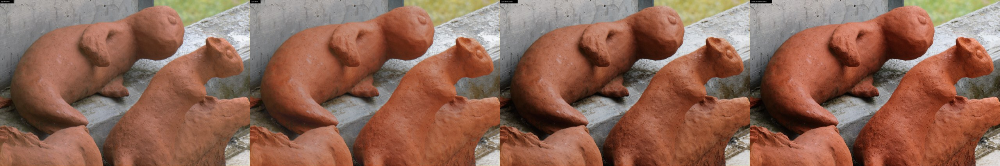
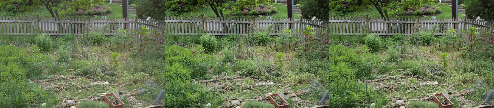
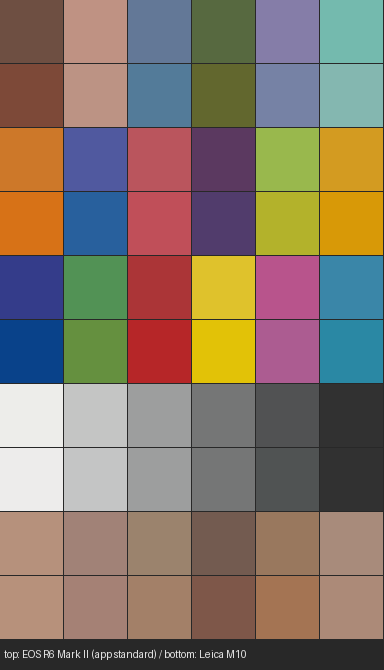

# Leica M10 と Canon の色の違い（調査報告）

アプリの「仕上げ → Leica M10」を作るために、Leica M10 と Canon（EOS R6 Mark II ほか）の色の違いを、手に入るデータから定量的に調べた結果です。
再現の手順とスクリプトは [training/leica/](../training/leica/README.md) にあります。



## まとめ

- **カメラの「色」は 3 段階で決まる**: ① センサーの分光感度（どの波長をどれだけ拾うか）、② メーカーの色行列（センサーの RGB を色に直す計算）、③ カメラ内 JPEG の仕上げ（トーンカーブと色づくり）。それぞれを別々のデータで測った。
- **① + ② センサーと色行列**: 同じ被写体を昼光で撮ると、EOS R6 Mark II（アプリの RAW 現像）と Leica M10（Leica の色行列）の色は平均 ΔE00 ≈ 4.8（最大 16）違う。
  Leica M10 は **黄〜黄緑・緑を黄み（暖色）側に 10〜16° 回し、やや暗く**、**肌は赤みが強い**（a* +3.1、彩度 1.13 倍）。**青は空色寄り、紫は青寄り**に写り、赤紫は彩度が低い。
- **③ カメラ内 JPEG**: Leica と Canon で中間調のコントラストはほぼ同じ（21.7 / 22.0 L*/段）だが、Leica は**白飛びまでの余裕が約 0.5 段広く、ハイライトがなだらか**で、**暗部はより深く沈む**。
  色づくりは逆向きで、Canon は赤・橙の彩度を上げ（ピクチャースタイル「スタンダード」）、Leica は DNG の色行列よりも**全体に彩度を落とす**（特に赤）。
- **合わせると**: Canon のカメラ内 JPEG に比べて Leica M10 のカメラ内 JPEG は、赤・赤紫の彩度が 0.72〜0.89 倍、緑が 0.64〜0.89 倍で黄み寄り（−15〜−20°）、黄色は同じ彩度でやや暗く暖かい。平均 ΔE00 4.5。
  レビューでよく言われる「彩度が控えめ」「肌が赤い・暖かい」「緑と黄色が Canon と大きく違う」（[Lensrentals](https://www.lensrentals.com/blog/2022/08/understanding-the-leica-look/)、[Street Silhouettes](https://www.streetsilhouettes.com/home/2017/3/13/leica-m10-vs-leica-sl-vs-canon-5d-mark-iv)）と一致する。
- アプリでは ①②③ をこの順に Canon の RAW へ掛ける。既定では**明るさは合成結果のまま**にして色だけを Leica に合わせ（Leica の JPEG の深い暗部で HDR 合成の意味がなくならないように）、「階調も合わせる」で Leica の JPEG のトーンカーブも掛けられる。

## 1. 調べ方

カメラの色は次のように決まります。

```
被写体の分光反射率 × 光源 ─→ ① センサーの分光感度 ─→ RAW の RGB
    ─→ ホワイトバランス ─→ ② 色行列（メーカーの「色の作り方」）─→ 色（XYZ・sRGB）
    ─→ ③ カメラ内 JPEG の仕上げ（トーンカーブ・色づくり）─→ JPEG
```

- アプリの RAW 現像は ①（Canon のセンサー）+ ②（Adobe の色行列、LibRaw）+ 癖のない表示（sRGB + 肩特性）で、Canon の色づくり（③）は入っていません。
- 「Leica M10 で撮った色」にするには、① と ② を「Leica M10 のセンサー + Leica の色行列」に置き換え、③ に Leica の JPEG エンジンを使います。

同じ場面を両方のカメラで撮った画像があれば直接比べられますが、そのようなデータ（DPReview のスタジオ比較など）はこの環境からは取得できなかったため、各段階を別々のデータで測りました。

| 段階 | 測り方 | データ |
| --- | --- | --- |
| ① センサー | 分光シミュレーション（分光感度 × 照明 × 反射率） | 1,000 機種以上の推定分光感度（Solomatov & Akkaynak, ICCP 2023）、ColorChecker 24 色、CIE 2017 の 99 色、肌 15,256 件、CIE 標準光源 10 種 |
| ② 色行列 | Leica が DNG に埋め込んだプロファイルを直接読む | Leica M10 の DNG（2017 年 1 月のファイル）のヘッダ |
| ③ JPEG エンジン | 同じコマの RAW とカメラ内 JPEG を画素単位で位置合わせして当てはめ | Leica M10-R の DNG（カメラ内 JPEG 入り）、Canon EOS R6 の CR3（ピクチャースタイル「スタンダード」、どちらも CC0） |

## 2. Leica が DNG に埋め込むプロファイル

Leica M10 の DNG には、Leica が作った「LEICA M10」という名前のカメラプロファイルが入っています（Lightroom の「埋め込み」プロファイル）。中身を読むと:

- **色行列だけのプロファイル**。色相・彩度を変える表（LookTable）は 3×2×1 の大きさで中身は恒等（色相 0°、彩度 1 倍）、HueSatMap・ForwardMatrix・トーンカーブはない
- 色行列（XYZ → カメラ RGB）は **Adobe（LibRaw・Lightroom の Adobe Standard が使う値）とは別の、Leica 独自の値**

  ```
  ColorMatrix1（標準光源 A）       ColorMatrix2（D65）
   0.8950 -0.3206  0.0493          0.8059 -0.2783 -0.0605
  -0.5830  1.6099 -0.0022         -0.5291  1.4417  0.0552
  -0.0837  0.2769  0.7937         -0.0935  0.3003  0.6367
  ```

- BaselineExposure は −0.78 段（Lightroom などは既定で 0.78 段暗く表示する。M10 の DNG が「控えめ」に見えると言われる一因）

つまり「Leica の色」の土台は、Leica 独自の色行列で素直に色を出したものです。M10-R の DNG も同じ構造（行列だけ・LookTable は恒等）でした。

## 3. センサー（分光感度）と色行列の違い

EOS R6 Mark II の RAW をアプリと同じ方法（LibRaw、Adobe の D65 行列）で現像した色と、同じ被写体を Leica M10 で撮って Leica の色行列（DNG と同じ手順: 2 光源の行列を色温度で補間し Bradford で色順応）で現像した色の違い（D65、ColorChecker + CIE 2017 の 99 色、Canon 側の色相で分類）:

| CIELAB 色相 | 目安 | 彩度（M10 / Canon） | 色相のずれ | 明度 L* |
| --- | --- | --- | --- | --- |
| 0〜30° | 赤紫〜赤 | ×0.98 | +2.1° | −0.2 |
| 30〜60° | 赤〜橙 | ×1.11 | −2.9° | −0.9 |
| 60〜90° | 橙〜黄 | ×1.16 | −10.2° | −2.2 |
| 90〜120° | 黄〜黄緑 | ×1.06 | −16.3° | −1.6 |
| 120〜150° | 黄緑〜緑 | ×0.91 | −14.6° | −1.8 |
| 150〜180° | 緑 | ×0.91 | −5.6° | −1.0 |
| 180〜210° | 緑〜青緑 | ×1.01 | −0.2° | −0.4 |
| 210〜240° | 青緑〜空色 | ×1.21 | −14.5° | +1.3 |
| 240〜270° | 空色〜青 | ×1.16 | −18.2° | +1.8 |
| 270〜300° | 青〜紫 | ×0.91 | −27.4° | +2.0 |
| 300〜330° | 紫〜赤紫 | ×0.75 | −18.5° | +2.0 |
| 330〜360° | 赤紫 | ×0.79 | −3.8° | +0.9 |

（色相のずれは CIELAB の色相角。マイナスは時計回りで、黄緑 → 黄、緑 → 黄緑、青 → 空色、紫 → 青の向き）

- **肌**（ISSA 15,256 件）: a* +3.1（赤み）、b* +0.6、彩度 1.13 倍、色相 −6.4°（赤寄り）、L* −0.8。Leica M10 の肌が「赤い・暖かい」と言われるのはセンサーと色行列の段階から
- **色の正確さ**（人の目で見た色との ΔE00 平均、D65）: EOS R6 Mark II（Adobe の行列）2.66、Leica M10（Leica の行列）4.57、Leica M10（Adobe の行列）4.84。
  Leica M10 は Canon よりも「正確」ではなく、上の表の偏りがそのまま個性になっている（レビューの「色の忠実度を少し犠牲にしている」という評とも合う）
- 照明による違い: 電球（標準光源 A）では差がさらに大きい（平均 ΔE00 ≈ 6）。アプリの RAW 現像は D65 の行列だけで色順応をしないのに対し、Leica の DNG は 2 光源の行列を補間するため

アプリではこの違いを 3×3 行列（白は白のまま）で表し、昼光用と電球光用を撮影時の色温度で補間します。当てはめた後の残差:

| 照明 | ColorChecker | CIE 99 色 | 肌（当てはめに使っていない 14,956 件） |
| --- | --- | --- | --- |
| D65 | 4.78 → 0.43 | 4.79 → 0.74 | 2.72 → 0.49 |
| D50 | 5.01 → 0.66 | 4.95 → 0.95 | 2.93 → 0.45 |
| 蛍光灯 FL2 | 6.00 → 1.26 | 5.82 → 1.53 | 4.35 → 0.77 |
| LED（B3） | 5.71 → 1.13 | 5.49 → 1.38 | 4.06 → 0.73 |
| 3200K | 5.70 → 0.88 | 5.60 → 1.35 | 3.87 → 0.55 |
| 標準光源 A | 6.08 → 1.01 | 6.03 → 1.45 | 4.43 → 0.40 |

（ΔE00 の平均、変換前 → 変換後。全照明の表は `training/leica/out/report.md`）

**確からしさ**: 分光感度は実測値ではなく、色行列などから推定したものです。実測値のあるカメラ 7 機種で比べると、推定値から作った色と実測値から作った色の差は平均 ΔE00 0.9〜2.3 でした（`ssf_check.py`）。上の Canon と Leica の差（約 4.8）はこれより十分大きいので傾向は信頼できますが、個々の色の数値には ±2 程度の不確かさがあります。

## 4. カメラ内 JPEG の仕上げ（JPEG エンジン）

RAW と、同じコマに埋め込まれたフルサイズのカメラ内 JPEG の位置を合わせ（相関 0.98〜0.99）、16×16 画素のブロックの平均どうしを比べて `JPEG ≈ T(e·A·x)` を当てはめました（x: メーカーの色行列で現像した色、A: 3×3 行列、T: R・G・B に同じトーンカーブ）。
画像の右端 20% は当てはめに使わず検証に回しています。

| | 使ったブロック | 当てはめの誤差 ΔE00（学習 / 検証） |
| --- | --- | --- |
| Leica M10-R（JPEG 設定は標準） | 33,476 | 1.77 / 1.78 |
| Canon EOS R6（スタンダード） | 25,924 | 0.60 / 0.82 |



### トーンカーブ

中間グレー（18%）からの段数と JPEG の値（sRGB）:

| | −5 | −4 | −3 | −2 | −1 | 0 | +1 | +2 | +3 | 中間調の傾き | 白飛びまで |
| --- | --- | --- | --- | --- | --- | --- | --- | --- | --- | --- | --- |
| Leica M10-R | 6 | 8 | 19 | 37 | 69 | 119 | 177 | 217 | 250 | 21.7 L*/段 | +3.38 段 |
| Canon EOS R6 | 4 | 9 | 18 | 36 | 69 | 119 | 177 | 223 | 255 | 22.0 L*/段 | +2.91 段 |
| （参考）Lightroom の既定 | 8 | 15 | 26 | 46 | 76 | 119 | 172 | 218 | 249 | 20.1 L*/段 | +3.34 段 |
| （参考）アプリの標準 | 17 | 27 | 41 | 60 | 85 | 118 | 162 | 221 | 253 | 15.3 L*/段 | 肩特性 |

- 中間調のコントラストは Leica と Canon でほぼ同じ
- Leica は**ハイライトに約 0.5 段の余裕**があり、+2 段で 217（Canon は 223）となだらかに白へ向かう
- Leica は**暗部が深い**（−4 段で 8、その下は sRGB 5 前後で床になる）
- アプリの標準（sRGB そのまま）はどのカメラの JPEG よりも軟調

### 色づくり（A 行列）

メーカーの色行列で現像した色 → JPEG に掛かる行列:

```
Leica M10-R                    Canon EOS R6（スタンダード）
 0.801  0.117  0.081            1.030 -0.090  0.060
 0.028  0.938  0.035           -0.023  0.950  0.073
 0.031  0.043  0.926           -0.010  0.083  0.927
```

- Leica は非対角成分がすべて正で、**DNG の色行列よりも全体に彩度を落として** JPEG にしている（特に赤: 赤の行に緑・青が 2 割混ざる）
- Canon は赤から緑を引いて**赤・橙の彩度を上げている**（ピクチャースタイル「スタンダード」の鮮やかさ）

## 5. 仕上がりの違い

EOS R6 Mark II で撮った色見本（D65）を、それぞれの方法で仕上げたときの違い:



### Canon のカメラ内 JPEG → Leica M10 のカメラ内 JPEG

| CIELAB 色相 | 目安 | 彩度 | 色相 | 明度 L* |
| --- | --- | --- | --- | --- |
| 0〜30° | 赤紫〜赤 | ×0.78 | −3.2° | −0.5 |
| 30〜60° | 赤〜橙 | ×0.89 | +1.1° | −1.4 |
| 60〜90° | 橙〜黄 | ×1.01 | −0.1° | −3.6 |
| 90〜120° | 黄〜黄緑 | ×1.05 | −9.2° | −2.9 |
| 120〜150° | 黄緑〜緑 | ×0.89 | −19.8° | −2.3 |
| 150〜180° | 緑 | ×0.73 | −14.6° | −2.0 |
| 180〜210° | 緑〜青緑 | ×0.64 | −0.1° | −1.4 |
| 210〜240° | 青緑〜空色 | ×0.95 | −2.5° | +1.0 |
| 240〜270° | 空色〜青 | ×0.98 | −11.1° | +1.9 |
| 270〜300° | 青〜紫 | ×0.86 | −16.5° | +3.1 |
| 300〜330° | 紫〜赤紫 | ×0.79 | −18.7° | +2.0 |
| 330〜360° | 赤紫 | ×0.72 | −11.5° | +0.8 |

平均 ΔE00 4.5（95 パーセンタイル 9.5）。**緑と黄色で差が大きい**という Lensrentals の比較（M10 と EOS 5D Mark IV の JPEG）と一致します。
一方、同じ記事では「RAW を Lightroom などで現像するとほとんど差がない」とも報告されています。これは Adobe のプロファイル（Adobe Standard など）が機種ごとの違いを打ち消すように作られているためで、Leica の埋め込みプロファイル（行列だけ）やカメラ内 JPEG を使うと、上の違いが現れます。

### アプリの標準 → Leica M10（アプリの既定: 明るさはそのまま）

| CIELAB 色相 | 目安 | 彩度 | 色相 |
| --- | --- | --- | --- |
| 0〜30° | 赤紫〜赤 | ×1.21 | +1.9° |
| 30〜60° | 赤〜橙 | ×1.35 | −2.1° |
| 60〜90° | 橙〜黄 | ×1.09 | +0.2° |
| 90〜120° | 黄〜黄緑 | ×1.19 | −12.1° |
| 120〜150° | 黄緑〜緑 | ×1.13 | −15.8° |
| 150〜180° | 緑 | ×0.99 | −9.4° |
| 180〜210° | 緑〜青緑 | ×0.76 | +1.2° |
| 240〜270° | 空色〜青 | ×0.96 | −21.5° |
| 270〜300° | 青〜紫 | ×0.92 | −17.4° |
| 330〜360° | 赤紫 | ×0.89 | −5.8° |

アプリの標準は軟調で彩度も低いため、Leica M10 にすると赤・橙・黄緑はむしろ鮮やかになります（それでも Canon の JPEG よりは控えめ）。

## 6. アプリでの再現方法

`src/core/look.ts`（Python の参照実装 `training/leica/export_model.py` と 1 対 1）。合成・トーンマッピング・効果の強さの後、仕上げ調整の前に掛けます。比較表示の「合成前」にも同じものを掛けます。

1. **表示用の値をシーンのリニア値に戻す**
   - RAW: アプリの標準の表示（sRGB + 肩特性）の逆
   - 「おまかせ」の結果: HDR+ の仕上がり（カメラ内 JPEG 並みのメリハリ）を学習しているので、カメラ内 JPEG のトーンカーブの逆（効果の強さの割合で混ぜる）。素の表示として戻すとメリハリが二重にかかる
   - JPEG の写真: Canon のピクチャースタイル「スタンダード」（トーンカーブ + 色の行列）の逆
2. **センサーの違い**: 3×3 行列。機種（Canon 19 機種。R8 は R6 Mark II と同じセンサー）ごとに、撮影時のホワイトバランスと色行列から推定した色温度で昼光用と電球光用を補間する。
   データのない機種は「色を正確に写すカメラ」として変換し、Leica M10 系の RAW はそのまま
3. **Leica の JPEG エンジン**: 3×3 行列 + トーンカーブ。中間グレーは Leica の JPEG と同じ sRGB 118.9 に合わせる
4. **明るさ**: 既定では輝度（リニア）を元の画像に戻し、色相・彩度だけを Leica にする。Leica の JPEG は暗部を深く沈める（中間グレーの 4 段下で sRGB 8。アプリの標準は 27）ので、そのまま掛けると HDR 合成で起こした暗部がつぶれるため。
   「階調も Leica のカメラ内 JPEG に合わせる」をオンにすると、トーンカーブも Leica のものになる

## 7. 限界

- **JPEG エンジンは M10-R で測った**: M10 そのものの RAW + JPEG の組は手に入らなかったため、同じ M10 シリーズ（同じ世代の画像処理、JPEG 設定は標準）の M10-R で測りました。センサーは違うので、エンジンの行列は「その機種の Leica の色行列で現像した色 → JPEG」として測り、M10 の色（②）に掛けています。
  Leica が M10 と M10-R で JPEG の味付けを変えていれば、その分はずれます
- **1 機種 1 場面**: Leica は庭（緑・黄緑・茶・灰色）、Canon は素焼きの置物（橙・灰色）の 1 枚ずつです。行列とトーンカーブのように全体に効くものは当てはめられますが、写っていない色（Leica の鮮やかな赤・青など）だけに効く調整は測れていません
- **分光感度は推定値**: 上記のとおり ±2 ΔE00 程度の不確かさがあります
- **Leica M10 の色行列はファームウェアによって違う可能性**: 読んだのは 2017 年 1 月（発売直後）のファイルです
- **カメラ内 JPEG の局所処理**（シャープネス・ノイズリダクション・Canon のオートライティングオプティマイザ）は再現しません

同じ場面を両方のカメラで撮ったデータ（DPReview のスタジオ比較、raw.pixls.us の M10 の DNG など）が使える環境なら、`training/leica/engine.py` と同じ方法で直接比べて精度を上げられます。

## 参考文献・データ

- G. Solomatov, D. Akkaynak, *Spectral Sensitivity Estimation Without a Camera*, ICCP 2023（[論文](https://arxiv.org/abs/2304.11549)、[データ](https://github.com/COLOR-Lab-Eilat/Spectral-sensitivity-estimation)）
- J. Jiang et al., *What is the space of spectral sensitivity functions for digital color cameras?*, WACV 2013（実測の分光感度）
- ISSA Skin Color Database（[butcherg/ssf-data](https://github.com/butcherg/ssf-data) 経由）
- CIE 224:2017（色の忠実度指数の 99 色）、ColorChecker の分光反射率（BabelColor）、[colour-science](https://www.colour-science.org/)
- Adobe, *Digital Negative (DNG) Specification*（色行列の補間・色順応の手順）
- RAW サンプル: [raw.pixls.us](https://raw.pixls.us/)（CC0、[endosome/elodie-test-assets](https://github.com/endosome/elodie-test-assets) 経由）
- [Understanding the 'Leica Look'](https://www.lensrentals.com/blog/2022/08/understanding-the-leica-look/)（Lensrentals, 2022）
- [Leica M10 vs Leica SL vs Canon 5D Mark IV - Comparing Color Rendering](https://www.streetsilhouettes.com/home/2017/3/13/leica-m10-vs-leica-sl-vs-canon-5d-mark-iv)（Street Silhouettes, 2017）
- [DxOMark: Leica M10](https://www.dxomark.com/leica-m10-classic-reinvented/)（色の振る舞いが独特との評）
